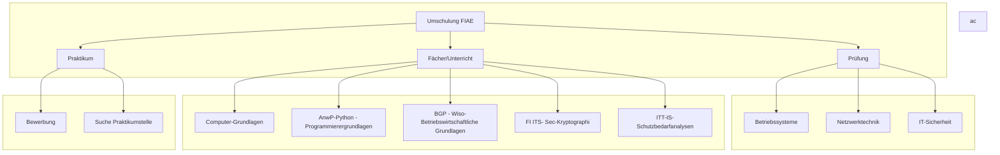

```mermaid
graph TB
  
  subgraph UmschulungFIAE[   ]
    A[Umschulung FIAE] --> B[Fächer/Unterricht]
    A --> C[Praktikum]
    A --> D[Prüfung]
    
  end

  subgraph Prüfung[ ]
    D --> F[Betriebssysteme]
    D --> G[Netzwerktechnik]
    D --> H[IT-Sicherheit]
  end
ac
  subgraph Fächer/Unterricht[  ]
    B --> I[Computer-Grundlagen]
    B --> J[AnwP-Python - Programmierergrundlagen]
    B --> K[BGP - Wiso-Betriebswirtschaftliche Grundlagen]
    B --> L[FI ITS- Sec-Kryptographi]
    B --> M[ITT-IS-Schutzbedarfanalysen]
  end

  subgraph Praktikum[ ]
    C --> N[Bewerbung]
    C --> O[Suche Praktikumstelle]
  end

  
  

```